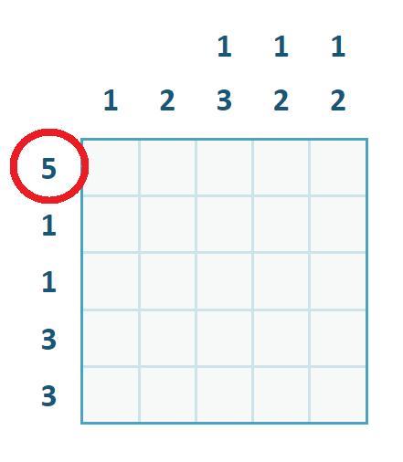
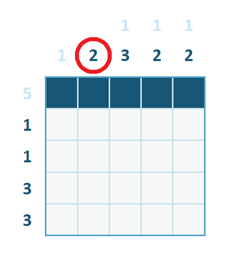
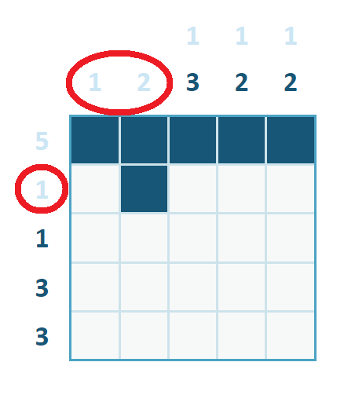
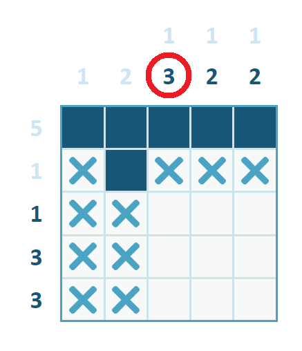
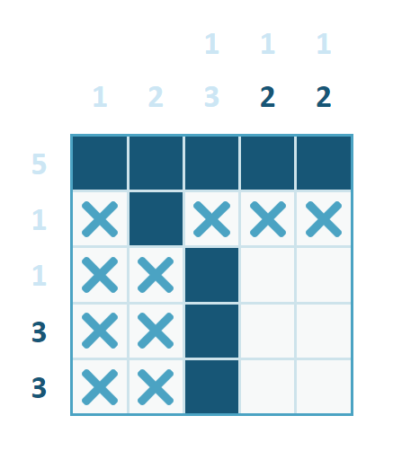

# How to play

## (Under construction 😅)

This is your first PICREACT puzzle. Here you can see a 5x5 grid with columns and rows numbers.

In the picture above, look at this number **5**, this means there are 5 filled cells in that row, so you can fill all of them like in the picture below.

Awesome! You filled your first cells. Notice how that last number **5** is now lighter, that's because you satisfied this condition.

Now look at this number **2** in the picture above, this means there are 2 **consecutive** filled cells, so you can fill another cell next to first one of this column as you can see in following image.

Look at these numbers in the picture above, they all are light and they have no others numbers, so you can conclude there are no others filled cells on its respective column/rows. Let's mark all of them with **crosses** as in the picture below.

Now look at this number **3** in the picture above. Notice there are now only 3 empty cells on this column, so all of them can be filled as you can see in picture below.

I'm sure you are now ready to solve rest of this puzzle by your own ;)

[**CLICK HERE AND TRY IT**](https://picreact.vercel.app/load/daeadfadeadebhadadafaf)
