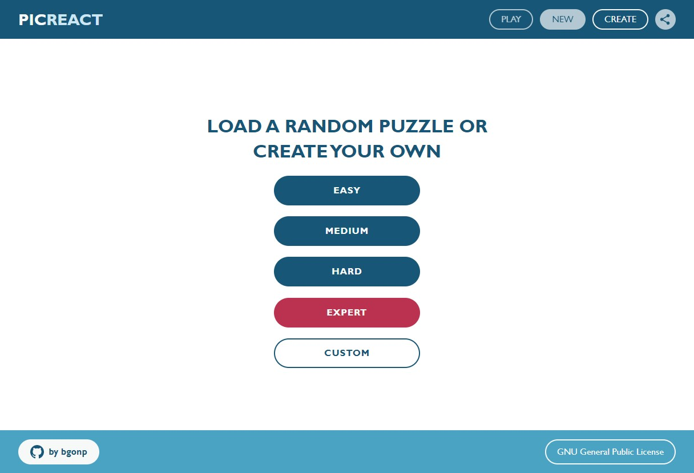
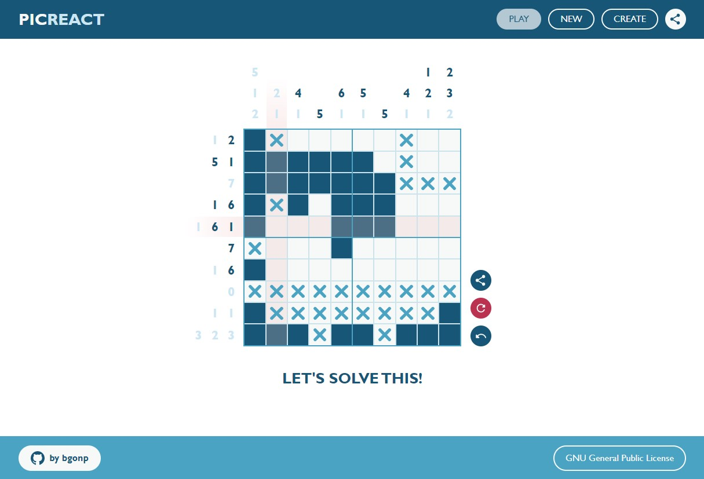
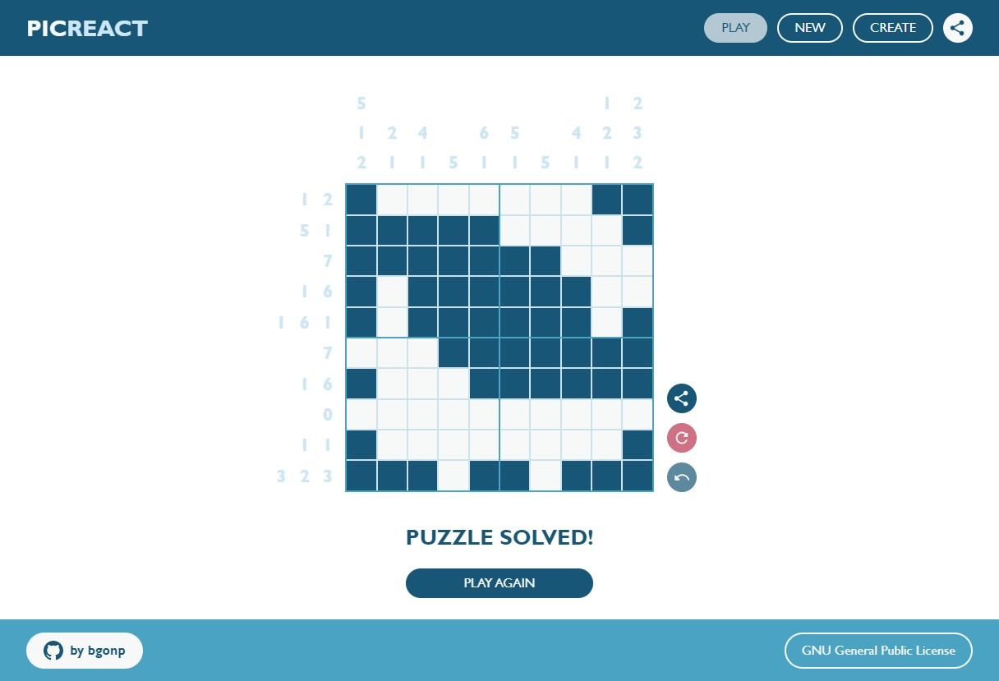
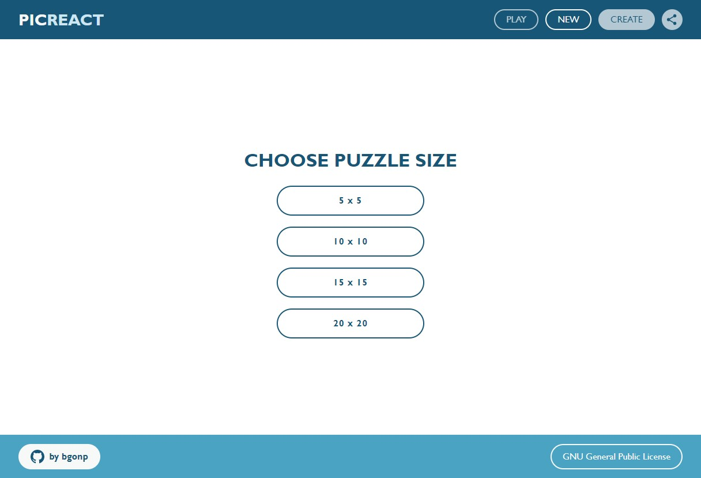
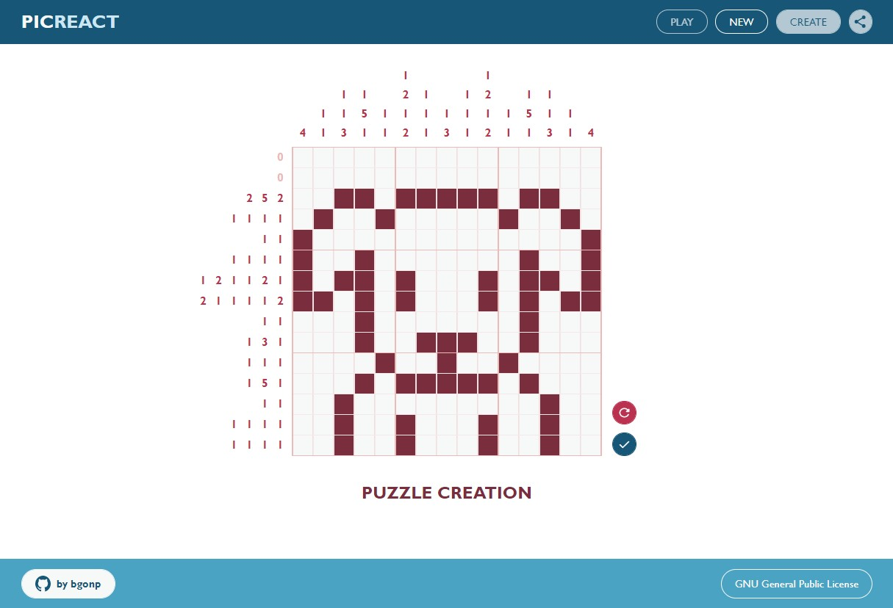

<h1 align="center">Picreat</h1>
<h3 align="center">Picross en React!</h3>

<p align="center">
  <a href="#descripcion-general">Descripción</a> •
  <a href="#prueba-picreact">Prueba Picreact</a> •
  <a href="#instalacion">Instalación</a> •
  <a href="#estructura">Estructura</a> •
  <a href="#uso">Uso</a> •
  <a href="#proximos-pasos">Próximos pasos</a> •
  <a href="#licencia">Licencia</a>
</p>

<p align="center">
  <a href="./LICENSE">
    
  </a>
  <a href="http://makeapullrequest.com">
    
  </a>
  
</p>

Un __nonograma__ es un juego de ingenio que se ha popularizado con los juegos __Picross__. Se basan en el estado de las celdas de una cuadrícula, que pueden estar vacías o rellenas. Para averiguar el estado de las celdas hay que servirse de las pistas, que línea a línea indican cuántas celdas estan rellenas y cómo se agrupan.

Para más detalles sobre cómo jugar, revisa [__cómo jugar__](HOW_TO_PLAY.md).

__Picreact__ es una versión de este juego desarrollada en __React__ con __TypeScript__. En lugar de cargar puzles ya creados, Picreact te da la posibilidad de generar puzles __aleatorios__ o crear (y __compartir__) los tuyos propios. Además, el estado del puzle que estes resolviendo __queda almacenado en el navegador__ para no perder tu progreso al cerrar.

Los puzles pueden tener más de una solución, para resolverlos solo tienes que satisfacer todas las pistas de filas y columnas, no igualar el estado original. Es decir, en ciertos casos puedes crear un puzle y al resolverlo hacerlo con un estado diferente al orginal.

## Descripción general
El proyecto está generado con [__Create React App__](https://create-react-app.dev/) con el template de TypeScript.

A pesar de ser un proyecto pequeño y no considerarlo necesario, he decidido aplicar _code splitting_ para probar `lazy` y `Suspense` de React.

Para los estilos he usado [__PostCSS__](https://postcss.org/). Al necesitar configuración propia de webpack para hacerlo funcionar, he optado por usar [__CRACO__ (Create React App Configuration Override)](https://github.com/gsoft-inc/craco#readme), que permite sobrescribir configuraciones de webpack sin necesidad de hacer `eject`. He usado características de [CSS stage 3](https://cssdb.org/) y reglas anidadas.

Para los iconos he generado componentes a partir de imágenes SVG y las fuentes de texto usadas son del sistema, de esta forma no he necesitado __ningún asset__ para el proyecto.

Utilizo un paquete propio ([__bgon-custom-hooks__](https://www.npmjs.com/package/bgon-custom-hooks), aún en desarrollo) para hooks recurrentes que uso en mis proyectos, en este caso `useLocalStorage` y `useTimeout`. En futuras versiones pretendo usar [__localForage__](https://localforage.github.io/localForage/) en lugar de localStorage.

Para gestionar las rutas uso [__wouter__](https://github.com/molefrog/wouter#reader), ya que es muy ligero y más que suficiente para un proyecto como este.
 
## Prueba Picreact
Puedes probar la versión más reciente desplegada en Vercel: [__PICREACT__](https://picreact.vercel.app/)

## Instalación
Clonar proyecto `git clone git@github.com:bgonp/picreact.git && cd picreact`\
Instalar dependencias `npm install`\
Desplegar entorno de desarrollo `npm start`\
Generar los estáticos (en /build): `npm run build`

## Estructura
```
picreact
├── build                 # Archivos estáticos generados.
├── public                # Archivo html de entrada. No hay assets.
├── src
│   ├── components        # Componentes de la aplicación.
│   │   └── icons         # Components de iconos.
│   ├── constants         # Constantes para controlar urls, tiempos, rutas...
│   ├── contexts          # Contextos usados. Maneja el estado del puzle y los modales.
│   ├── hooks             # Custom hooks para el puzle, el modal y el control de clicks.
│   ├── models            # Modelos globales TypeScript.
│   ├── pages             # Páginas que gestionan cada una de las rutas.
│   ├── router            # Gestión de rutas y carga de las páginas correspondientes.
│   ├── styles            # Estilos generales de la aplicación
│   │   └── components    # Estilos correspondientes a cada componente con CSS Modules.
│   ├── utils             # Funciones auxiliares de uso general.
│   └── index.tsx         # Punto de entrada que carga el componente padre.
├── .eslintrc             # Configuración de eslint. Partiendo de standard.
├── .prettier             # Configuración de prettier.
├── craco.config.js       # Configuración de webpack complementando la de CRA.
├── package.json          # Dependencias del proyecto.
├── postcss.config.js     # Configuración de PostCSS.
└── tsconfig.json         # Configuración para la transpilación de TypeScript.
```

## Uso


Sección __NEW__, desde aquí puedes elegir un puzle generado aleatoriamente o ir a la página de creación de puzle.
- __EASY__: Genera un puzle aleatorio de 5x5
- __MEDIUM__: Genera un puzle aleatorio de 10x10
- __HARD__: Genera un puzle aleatorio de 15x15
- __EXPERT__: Genera un puzle aleatorio de 20x20
- __CUSTOM__: Lleva a la sección de creación de puzle

También puedes acceder a estas secciones desde el menú del header.

----



Sección __PLAY__. Desde aquí se resuelve el puzle propuesto. __Botón izquierdo__ del ratón para marcar la casilla como rellena y __botón derecho__ para marcarla como vacía con una X. Botones laterales:
- __Compartir__: Copia una URL que al compartirla carga el puzle actual.
- __Restaurar__: Si te atascas puede ser mejor hacer borrón y cuenta nueva.
- __Deshacer__: Deshaz tus últimos movimientos si te equivocas (límite fijado a 10).

----



Si consigues __satisfacer todas las pistas__ de filas y columnas habrás resuelto el puzle. Aún puedes __compartirlo o cargar un nuevo puzle__.

----



Sección __CREATE__. Accede a esta sección desde la página principal o desde el menú principal en el header. Primero __elige el tamaño de tu puzle__ (de 5x5 a 20x20).

----



Una vez termines tu diseño, guárdalo desde el botón lateral. Ahora puedes __resolver tu propio puzle o compartirlo__ a través de URL desde el botón __compartir__.

----

## Próximos pasos
- HOW_TO_PLAY.md
- Tests (😅)
- Responsive
- i18n
- Readme en inglés
- localForage
- Favicon
- ...

## Licencia
[GNU Generic Public License](./LICENSE)